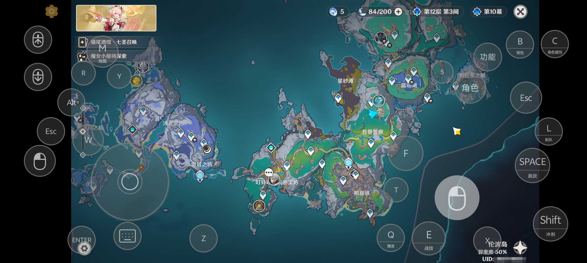
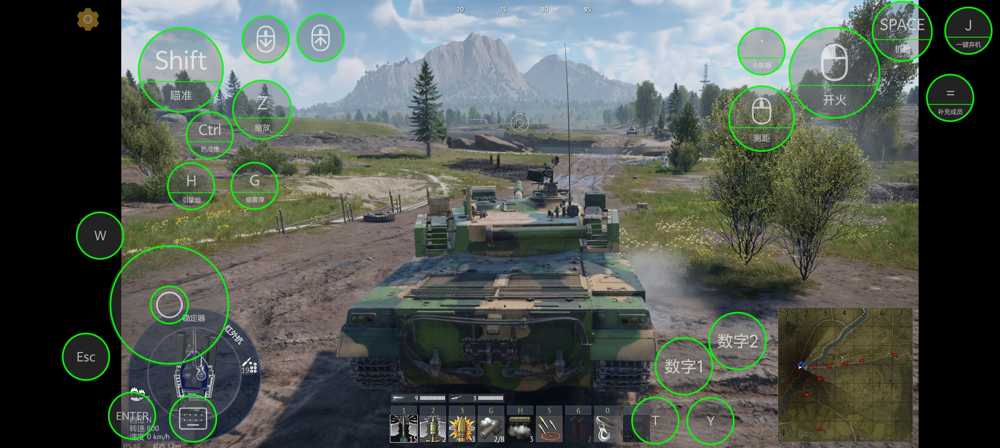
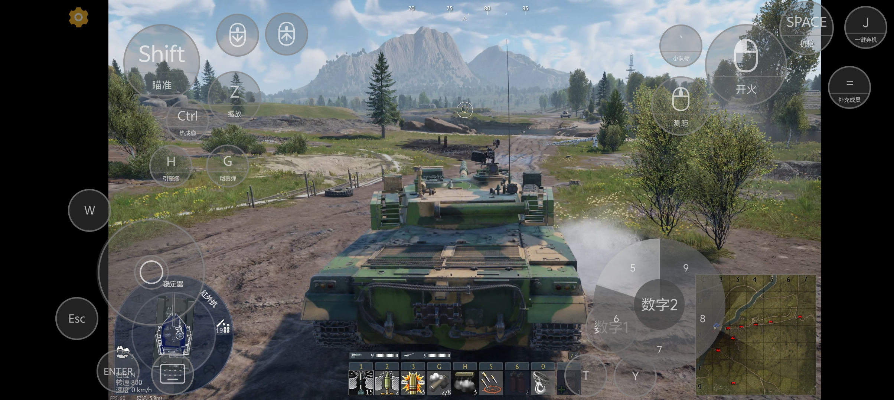
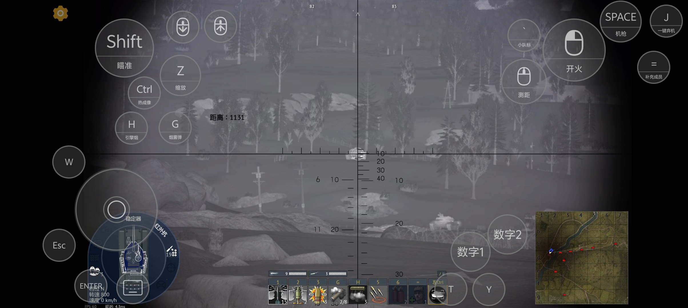

# TouchKit 使用说明

TouchKit 是 Artemis 面向触屏云游戏的鼠标、键盘与悬浮按键方案。全部控件都绘制在串流
界面内部，不需要申请 Android 的系统悬浮窗权限。

维护者准备 APK 和 GitHub Release 时，请阅读[发布与签名手册](RELEASE_GUIDE.zh-CN.md)。

## 快速开始

1. 打开 **设置 > 云游戏操作**。
2. 开启 **云游戏模式**。应用会自动把 **鼠标模拟方式** 切换为云游戏模式；改选其他鼠标
   模式会同步关闭该开关。
3. 需要屏幕按键时开启 **显示悬浮按键**。它控制按键层是否显示，不改变鼠标模拟方式。
4. 进入 **编辑悬浮按键布局**。拖动控件可移动，轻点控件可修改属性；编辑器不会向远端
   发送任何输入。
5. 点击 **展开** 可调整鼠标移动曲线、X/Y 灵敏度、不透明度、振动和布局迁移；点击
   **收起** 可恢复精简视图。

如果游戏中的点击全部由悬浮按键承担，可以开启 **禁用触摸手势**。开启后只保留单指
滑动移动鼠标，轻点点击、双击拖动、多指滚动、惯性移动和三至五指快捷操作都会停用，
悬浮按键不受影响。

## 触摸手势

| 手势 | 远端操作 |
| --- | --- |
| 单指滑动 | 相对移动鼠标 |
| 单指轻点 | 鼠标左键 |
| 双击后滑动 | 按住鼠标左键拖动 |
| 双指轻点 | 鼠标右键 |
| 双指滑动 | 垂直或水平滚动 |
| 三指轻点 | 显示 Android 软键盘 |
| 四指轻点 | 切换完整屏幕键盘 |
| 五指轻点 | 在启用相关选项时打开 Artemis 快捷菜单 |

## 控件与按键写法

编辑器可添加键盘按键、组合键、鼠标左键/右键/中键、侧键 4/5、上下滚动、按键轮盘、
摇杆、方向键和软键盘按钮。

按键统一使用“`按键=说明`”格式，说明可以留空：

```text
F1
F1=冒险之证
Ctrl+C=复制
LeftCtrl+LeftShift+Space
Num1
```

`1` 与 `Num1` 是不同的物理按键，`LeftCtrl` 与 `RightCtrl` 也不相同。需要在悬浮控件上
显示左右侧或数字键盘区别时，勾选 **显示 L/R/Num 标记**。

新建按键轮盘时内容默认为空。每行填写一个扇区，最多 8 个。轮盘平时收起，按住后展开，
将手指滑向目标扇区即可执行对应按键。

## 触发方式

- **按住触发**：触摸时按下，松手时释放。开启云游戏模式后，按住控件滑动仍可移动鼠标。
- **锁定**：第一次轻点保持按下，第二次轻点释放。
- **定时长按**：按下后保持设定时长，可调范围为 0.1～5.0 秒；计时结束前再次轻点可立即
  取消并释放。
- 滚动控件可单独调整每次滚动步幅，也可开启长按连续滚动。

## 界面截图

### 原神手机布局



### 战争雷霆布局编辑



### 按键轮盘



### 实际串流效果



## 布局与游戏自动匹配

在 **按键布局** 中可以选择、新建或删除布局；当前布局的重命名位于编辑器的
**更多操作** 中。

Artemis 会记住每台主机上每个游戏最后使用的布局。下次从同一台主机启动该游戏时会自动
恢复；没有记录的游戏使用当前默认布局。

## 手动迁移布局

展开 **云游戏操作**，进入 **导入与导出布局**：

- **导出当前布局**：将当前布局保存为一个 JSON 文件。
- **导入布局**：校验文件后新建一套布局并自动切换，不会覆盖已有布局。
- 导出文件不包含主机、账号、串流画质设置和“游戏—布局”自动匹配关系。
- 可以导入旧版 Artemis 直接导出的按键布局 JSON，但暂不支持迁移 Artemis 的全部应用设置。

不同设备的屏幕比例不同时，迁移后可能仍需在编辑器中微调位置或大小。

仓库提供了可以直接导入的[原神手机布局](examples/genshin-impact-phone.json)与
[战雷陆战手机布局](examples/war-thunder-ground-phone.json)，相关说明见
[示例目录](examples/README.md)。

## 不透明度

设置页中的滑块统一调整灰色底和外边框。在编辑器的 **更多操作** 中，还可以分别调整
全局灰色底与全局文字/图标不透明度；单个控件仍可覆盖自己的灰色底不透明度。

## 陀螺仪辅助瞄准

在布局中添加陀螺仪控件，轻点即可锁定或关闭陀螺仪辅助瞄准。启用后，手机转动会转换为
相对鼠标移动，并保持屏幕常亮。可分别调整 X/Y 灵敏度、死区和轴向反转；不同设备的传感器
方向可能不同，首次使用时应在安全场景中校准。

## 推荐测试清单

- 左手按住鼠标键，右手在空白区域滑动或轻点，指针不应跳到屏幕边缘。
- 普通按键、组合键和鼠标键在按住、锁定、定时长按后都能正确释放。
- 摇杆松手后方向键立即释放。
- 同一游戏重新启动后恢复上次布局；其他游戏不被错误套用。
- 导出到另一台设备后可以导入为新布局，并保留按键名称、说明和触发方式。
